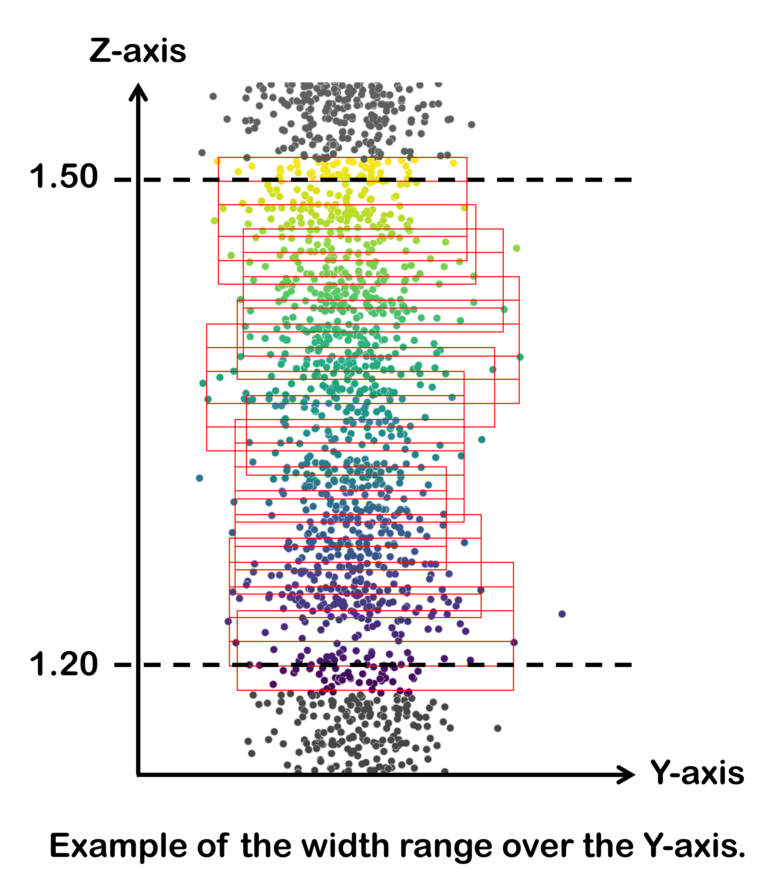

# A novel approach for distinguishing noise and information in forest MLS-point clouds
# Description
3D-laser scanning is a cornerstone of modern forestry and ecological research, 
enabling detailed insights into forest structures and dynamics. Although point 
cloud processing and noise management are crucial steps in the exploitation of 
LiDAR data, current denoising methods often fail to distinguish noise correctly
by overlooking the complexity of noise distribution within forest point clouds. 
This is particularly problematic in areas with smaller stems and branches, where 
the pronounced curvature of such structures leads to light diffraction effects 
that complicate reliable detection, resulting in a loss of relevant information 
and introducing potential biases.

This novel noise compression method addresses these issues and effectively 
distinguishes noise from valuable structural information within MLS-derived point clouds. 
By self-optimizing its parameters against ground-truth data, our method significantly
enhances the accuracy of key metrics such as DBH and stem taper, while preserving 
essential structural details.

### Related paper
More information about this method can be found in the following paper:
_Available soon_

# General workflow
<p align="center">

</p>

### Details on LiDAR-derived DBH estimation
As our main objective is to obtain point clouds that are visually faithful to reality, the 
LIDAR-derived values used for parameterization refer to the observed width of each stem's 
point cloud, rather than the DBH value per se. Nevertheless, it is referred to as DBH-LiDAR
in this program. As shown in the following figure, DBH-LiDAR value of each stem is evaluated 
over several height layers (each layer has a thickness of 5 cm), starting at 120 cm and 
increasing by 1.5 cm per iteration, up to 150 cm. For each layer, we calculate the X and Y ranges, 
using points representing the 1st and 99th percentiles to reduce the influence of outliers. 
The average of these values over all iterations is used as an estimate of the observed width 
of the point cloud.
<p align="center">

</p>

# Installation

### 1️⃣ Create a Virtual Environment
To ensure a clean and isolated environment for dependencies, create a virtual environment. 
   
#### Using [Anaconda](https://www.anaconda.com/):
1. Open the **Anaconda Prompt** (_Windows_) or a terminal (_Mac/Linux_).
2. Run the following command, replacing `"myenv"` with your preferred environment name:
   ```bash
   conda create --name myenv python=3.9
   ```
3. Activate the environment:
   ```bash
   conda activate myenv
   ```
   
#### Alternatively, using [`venv`](https://docs.python.org/3/library/venv.html) (if you don't use Anaconda):
1. Run the following command, replacing `"myenv"` with your preferred environment name:
   ```bash
   python -m venv myenv
   ```
2. Activate the environment:
   * **Windows**:
     ```bash
     myenv\Scripts\activate
     ```
   * **Mac/Linux**:
     ```bash
     source myenv/bin/activate
     ```


### 2️⃣ Clone the Repository
Ensure `git` is installed, then run:
```bash
git clone https://github.com/macharlebois/NoiseCompressor.git
cd NoiseCompressor
```

### 3️⃣ Install Dependencies
With the virtual environment activated, install the required dependencies:
```bash
pip install -r requirements.txt
```

### 4️⃣ Run Tests
To ensure everything is working properly:
```bash
pytest
```

### ✅ Ready to Use!

🔎 Alternatively, executable files are available for download _(Windows version only)_:
* [`step1_OPTIMIZER.exe`](https://github.com/macharlebois/LMS_Compressor/releases)
* [`step2_COMPRESSOR.exe`](https://github.com/macharlebois/LMS_Compressor/releases)

# How to use
As you can see with the [general workflow](#general-workflow), this method is divided into three main steps.
However, the __skeletonization__ step is integrated into the __parameterization__ and __compression__ steps, 
so it is not presented as a distinct running script in the following.


## ▶️ STEP 1 : PARAMETERIZATION
In order to find the parameter values that best fit your data, we integrated a parameterization
step to our program. The optimization process tests different parameter combinations on DBH 
(diameter at breast height) accuracy by comparing LiDAR-derived to field-measured values.

💡 If you simply wish to try the program, download the available [try-out files](https://doi.org/10.6084/m9.figshare.28514189)
and skip the referential data preparation.

1. Prepare the __referential data__:
   
   Using an editing software (e.g. _CloudCompare_), manually segment 15 to 30 stems (for which 
   field-measured DBH values are known) from the original point cloud and save each stem as an 
   individual stem file (`*.ply` or `*.csv`). Make sure that the selected stems represent a 
   gradient of DBH classes. Fill in the `stem_information.xlsx` (available [here](example_files)) 
   with the corresponding ground-truth data.

2. Add __input files__ to your working directory:

   - `individual_stem_files` (folder containing individual stem files in `*.ply` or `*.csv`)
   - `param_limits.xlsx` (user's parameters and threshold limits, download template [here](example_files/param_limits.xlsx))
   - `stem_information.xlsx` (individual stems information and ground-truth data, download template [here](example_files/stem_information.xlsx))

   ⚠️ _Note that input files and folder (in blue) must be named and organized as shown below._

   

3. Run the __step1_OPTIMIZER__ script:

    ```bash
    python step1_OPTIMIZER.py
    ```
   or
    ```bash
    step1_OPTIMIZER.exe
    ```
   During this step, you will be asked to:
   - select a `threshold` (_skeleton index_ or _fraternity index_, see [related paper](#related-paper) 
      for more information)
   - create a grouped referential file (or import an existing one, if this is not the first run)
   - generate a new skeleton (or import an existing one, if this is not the first run)
     - if generating a new skeleton, you will be asked to set the skeletonization parameters 
     (`voxel_size`, `search_radius` and `max_relocation_dist`) or use _default values_.
   
     <br>
   💾 __OUTPUT FILES__  
   When the parameterization is completed, the script will output the following files:
   - a grouped referential stem file (`ref_stems.ply`)
   - a skeleton file (`ref_stems_skeleton.csv`)
   - the results of the untreated data (`untreated_relation.csv`)
   - an optimization results folder (`optimizer_results`) containing:
     - the results of the compressed stems with the best parameter combination (`optimized_relation.csv`)
     - the optimized parameters and threshold values (`optimized_param.csv`)
     - the optimization graphs comparing the untreated and compressed stems (`optimized_graph_results.png`)


## ▶️ STEP 2 : COMPRESSION
Now that you have optimized your parameters and threshold values, you can compress your point cloud.

💡 If you simply wish to try the program, use the grouped referential stem file (`ref_stems.ply`) created 
during previous step as the point cloud to compress.

1. Run the __step2_COMPRESSOR__ script:
    
   ```bash
   python step2_COMPRESSOR.py
   ```
   or
    ```bash
    step2_COMPRESSOR.exe
    ```
   During this step, you will be asked to:
   - select a `threshold` (_skeleton index_ or _fraternity index_, see [related paper](#related-paper) 
      for more information)
   - select the `pointcloud.ply` you wish to compress
   - generate a new skeleton (or import an existing one, if this is not the first run)
     - if generating a new skeleton, you will be asked to set the skeletonization parameters 
      (`voxel_size`, `search_radius` and `max_relocation_dist`) or use _default values_.
   - set the compression parameters (`m1`, `m2`, `b` and `threshold` from the optimization results `optimized_param.csv`).
   
     <br>
   💾 __OUTPUT FILES__  
   When the compression is completed, the script will output the following files:
   - a skeleton file (`pointcloud_skeleton.csv`)
   - your compressed point cloud (`pointcloud_compressed.ply`)


