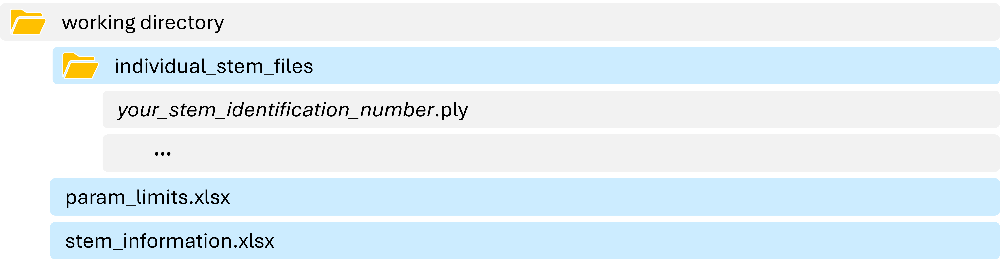

<p align="center">

</p>

<div align="center">

[](https://www.gnu.org/licenses/gpl-3.0)
[](https://www.python.org)
[](https://www.anaconda.com/)
[](https://www.jetbrains.com/pycharm/)
[](https://github.com/macharlebois/NoiseCompressor)
[](https://github.com/features/copilot)

</div>

<br>

# General workflow
<p align="center">

</p>

This compression method processes noisy point clouds by distinguishing outliers and noise 
from actual information in three main steps. During the first step, the algorithm performs 
an initial maximum compression (skeletonization) on the point cloud to generate a directional
indicator for each point (section 2.1). The second step consists in optimizing the compression
parameters by comparing LiDAR-derived measurements to field observations (this step is not 
mandatory but strongly improves denoising; see [related paper](#related-paper) for further 
details). During the third step, the algorithm performs a final compression of the point cloud, 
using the skeleton and optimized parameters to relocate each point to its best-fitted position.

# Installation

### 1️⃣ Create a Virtual Environment
To ensure a clean and isolated environment for dependencies, you first need to create 
a new virtual environment ([Anaconda](https://www.anaconda.com/) is what we recommend, but you can also use `venv`).

<details>
<summary><i>Click for details</i></summary>
   
#### Using [Anaconda](https://www.anaconda.com/):
1. For first-time users, download and install Anaconda from [here](https://www.anaconda.com/products/distribution). 
2. Once the software is installed on your computer, open the **Anaconda Prompt** (_Windows_) or a terminal (_Mac/Linux_).
3. Run the following command, replacing `'myenv'` with your preferred environment name:
   ```bash
   conda create --name myenv python=3.9
   ```
4. Activate the environment:
   ```bash
   conda activate myenv
   ```
   

</details>

### 2️⃣ Clone the NoiseCompressor Repository
Ensure `git` is installed:
```bash
git --version
```

If `git` is not installed, download and install it from [here](https://git-scm.com/downloads).

Then, clone the repository and navigate into the project directory:

```bash
git clone https://github.com/macharlebois/NoiseCompressor.git
cd NoiseCompressor
```

### 3️⃣ Install Dependencies
With the virtual environment activated, install the required dependencies:
```bash
pip install -r requirements.txt
```

### 4️⃣ Run Tests
To ensure everything is working properly:
```bash
pytest
```

### ✅ Ready to Use!
<!-- 
🔎 Alternatively, executable files are available for download _(Windows version only)_:
* [`step1_OPTIMIZER.exe`](https://github.com/macharlebois/NoiseCompressor/releases)
* [`step2_COMPRESSOR.exe`](https://github.com/macharlebois/NoiseCompressor/releases)
-->
<br>

# How to use
As you can see on the [general workflow](#general-workflow), this method is divided into three main steps.
However, the __skeletonization__ step is integrated into the __parameterization__ and __compression__ steps, 
so it is not presented as a distinct running script in the following.

### ✨ Try the demo!
Please refer to the demo files to help you get started quickly. Since both demo scripts 
([`demo_step1_OPTIMIZER.py`](demo_step1_OPTIMIZER.py) and [`demo_step2_COMPRESSOR.py`](demo_step2_COMPRESSOR.py)) 
contain their own sample data, no data download is necessary. 
<details>
<summary><i>More details</i></summary>

__Simply run the demo script you wish to try!__
- ___Parameterization demo___ :
   ```bash
   python demo_step1_OPTIMIZER.py
   ```
  This script demonstrates the parameterization process (using the same 30 stems presented in our [related paper](#related-paper)).
<p align="center">

</p>
  
- ___Compression demo___ :
   ```bash
   python demo_step2_COMPRESSOR.py
   ```
  This script demonstrates the compression process on a single example stem (true DBH = 28cm).
<p align="center">

</p>
</details>
<br>

## ▶️ STEP 1 : PARAMETERIZATION 
In order to calibrate the parameter values that best fit your data, we integrated a parameterization
step to our program. Although this optimization is not mandatory, it is strongly recommended to avoid 
arbitrary settings of the parameters. However, given that a significant portion of the noise is related to the type of sensor used, scans captured 
by a same device and under similar conditions could be effectively compressed with a same combination of parameters. 
Therefore, a single parameterization could be sufficient to increase the algorithm's efficiency. 

> [!NOTE]  
>To this day, we have been able to calibrate four (4) different MLS devices, including _Velodyne VLP-16_, _Alpha-Geo 
>Lixel-L2_, _ZEB Horizon RT_, and _Faro Orbis_ (see _Available Calibrations_ section below for details).
>If you are using one of these devices, you can directly proceed to the __STEP 2 : COMPRESSION__ and use the 
>corresponding parameters.

<details>
<summary><b>Proceeding to parameterization</b></summary>

For this step, you will need to prepare some referential data (about 30 individual stems with known and variable DBH 
values). If you do not have access to such data, you may also consider calibrating your device in a controlled environment, 
as we did for the previously mentioned devices (see _Available Calibrations_ section below for details).

1. Prepare the __referential data__:
   
   Using an editing software (e.g. _CloudCompare_), manually segment (from the original point cloud) the stems for which 
   field-DBH values are known, and save each stem as an individual file (`*.ply` or `*.csv`). Make sure that the selected 
   stems represent a gradient of DBH classes. Fill in the `stem_information.xlsx` file (available [here](example_files)) 
   with the corresponding ground-truth data.

2. Add the following __input files__ to your working directory:

   - `individual_stem_files` (folder containing your individual stem files)
   - `stem_information.xlsx` (individual stems information)

   ⚠️ _Note that input files and folder (in blue) must be named and organized as shown below._

   

3. Run the __step1_OPTIMIZER__ script:
    Once your input files are ready, run the following command in your terminal:
    ```bash
    python step1_OPTIMIZER.py
    ```
   or execute the compiled file:
    ```bash
    step1_OPTIMIZER.exe
    ```
   When asked :
   - select the `Skeleton Index` (recommended) or the `Fraternity Index` threshold (the latter requires frame number 
      information; see [related paper](#related-paper) for details)
   - create a grouped referential file (or import an existing one, if this is not your first run)
   - generate a new skeleton (or import an existing one, if this is not your first run)

   <br>

4. Wait for the magic to happen... The optimization process may take some time depending on the size of your dataset.
   <br>
### 💾 __OUTPUT FILES__  
Once the parameterization is completed, the program will output the following files:

_** = SI or FI (depending on the selected threshold)_
- a grouped referential stem file (`ref_stems_**.ply`) 
- a skeleton file (`ref_stems_skeleton_**.csv`)
- the results of the untreated data (`untreated_relation.csv`)
- an optimization results folder (`optimizer_results_**`) containing:
  - the results of the compressed stems with the best parameter combination (`optimized_relation.csv`)
  - the optimized parameters and threshold values (`optimized_param.csv`)
  - the optimization graphs comparing the untreated and compressed stems (`optimized_graph_results.png`)
    <br>
</details>

<details>
<summary><b>Available Calibrations</b></summary>

Since noise characteristics are strongly related to the type of sensor used, we have set up an experimental calibration
system (in a controlled environment) to capture the noise arising from different sensors. To this day, we have been
able to calibrate four (4) different MLS devices, including _Velodyne VLP-16_, _Alpha-Geo Lixel-L2_, _ZEB Horizon RT_, 
and _Faro Orbis_. Optimized parameters and threshold values for these devices are summarized in the table below.


| MLS Device         | Threshold        | m1    | m2    | b     | threshold value |
|--------------------|------------------|-------|-------|-------|-----------------|
| Velodyne VLP-16    | Skeleton index   | 0.000 | 0.740 | 0.000 | 0.306           |
| Velodyne VLP-16    | Fraternity index | 0.000 | 0.740 | 0.000 | 0.186           |
| Alpha-Geo Lixel-L2 | Skeleton index   | 0.000 | 0.480 | 0.000 | 0.045           |
| ZEB Horizon RT     | Skeleton index   | 0.000 | 0.480 | 0.000 | 0.081           |
| Faro Orbis         | Skeleton index   | 0.000 | 0.260 | 0.000 | 0.079           |

Please contact use for any additional information regarding these calibrations.

</details>

<br>

## ▶️ STEP 2 : COMPRESSION
Once you have optimized your parameters and threshold values, you can proceed to the final compression of your point cloud.

💡 If you simply wish to try the program, use the grouped referential stem file (`ref_stems.ply`) created 
during previous step as the point cloud to compress.

<details>
<summary><b>Proceeding to compression</b></summary>

1. Run the __step2_COMPRESSOR__ script:
    
   ```bash
   python step2_COMPRESSOR.py
   ```
   or execute the compiled file:
    ```bash
    step2_COMPRESSOR.exe
    ```
   When asked :
   - select the `Skeleton Index` (recommended) or the `Fraternity Index` threshold (the latter requires frame number 
      information; see [related paper](#related-paper) for details)
   - select the original `yourpointcloud.ply` to compress
   - generate a new skeleton (or import an existing one, if this is not your first run)
   - set the parameters (`m1`, `m2`, `b` and `threshold` from the optimization results `optimized_param.csv`).
   
    <br>
2. Wait for the magic to happen... The compression process may take some time depending on the size of your dataset.
   <br>
### 💾 __OUTPUT FILES__ 
Once the compression is completed, the program will output the following files:

_** = SI or FI (depending on the selected threshold)_
- a skeleton file (`yourpointcloud_skeleton_**.csv`)
- your compressed point cloud (`yourpointcloud_compressed_**.ply`)

</details>
<br>

## Related paper
More information about this method can be found in the following article :
_Available soon_
